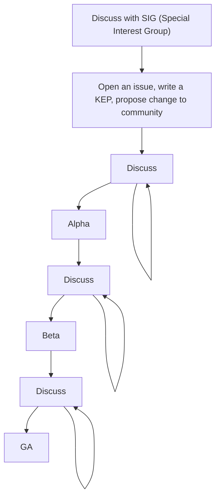

# Session Notes and Thoughts

## Contents

- [Understanding the Feature Lifecycle In Kubernetes](#understanding-the-feature-lifecycle-in-kubernetes)

## Understanding the Feature Lifecycle In Kubernetes

- **Title**: “Why Can’t Kubernetes Devs Just Add This New Feature? Seems So Easy!” - Understanding the Feature Lifecycle In Kubernetes
- **Presenters**: Ricardo Katz, VMware & Carlos Panato, Chainguard

It's not unusual for it to take *years* for feature requests to make it into a K8s release.

- Why does it take so long?
- Why are some feature requests refused?

Questions to be answered for all feature requests:
- Does this solve a wide problem or is it a niche/specific use case?
- Does the feature bring (or fix) security issues?
- Does the feature bring performance improvements or concerns?
- Is the feature a breaking change? (Not allowed in GA!)
- Has the feature been discuseed before? What was the outcome of that discussion?

### KEP (Kubernetes Enhancement Proposal)

A way to propose, communicate, and coordinate on new efforts for the Kubernetes project itself.

This process is still in beta but is mandatory for all proposals starting in K8s 1.14.

### The Process

1. Discuss with SIG: Come to a general agreement about a feature
1. KEP
    - is this an enhancement?
    - Does it need a blog post?
    - Does it require communication with other SIGs?
    - Can it follow standard graudation route (alpha --> beta --> GA)
    - Does it redesign something?
    - Is it a big effort?
    - Does it impact user experience?
1. Discuss (A lot!)
1. Alpha
1. Discuss again!
1. Beta
1. Discuss Again!
1. GA

### Why so much discussion?

- Discussion with the community is the best way to get a feature implemented.
- Not advised to fork the project...K8s is hard to maintain. Very large and complicated codebase.

### What happens when things get stuck in discussion?

e.g. *Can we add colors to kubectl output?*

Discussion:
  - There are workarounds
  - Can colors impact scripts?
  - Can someone write themes?
  - Does this impact accessibility?
  - Is this worth the effort?

It happens. In some cases, the outcome may not be the simple/optimal solution for the initial feature request, but it should be valuable overall. e.g In this specific case, work has begun on implementing a `kuberc` file for configuring kubectl. This will allow for colored output but will also do more...

### Conclusions

- Features are hard. Lots and lots of discussion. K8s codebase is massive and complicated.
- Breaking changes are unacceptable. This slows things down...
- Sometimes people aren't willing to follow the whole process. The process is long and tiring, but it ultimately keeps K8s working.

### Takeaways

- Don't give up! K8s needs ideas and features. Worth the effort.
- Take a look into past enhancements. Explore features, track/test features in alpha. Provide feedback.
- Don't be shy.
- Not only code changes are needed/required. You can propose changes/improvements to docs or provide feedback as a user.