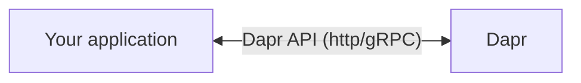

# Session Notes and Thoughts

## Contents

- [Extend Your Microservices With Pluggable Components Via Dapr](#extend-your-microservices-with-pluggable-components-via-dapr)
- [From Security Testing To Deployment In a Single PR](#from-security-testing-to-deployment-in-a-single-pr)
- [How To Build Production Grade DevOps Platform Using Argoproj](#how-to-build-production-grade-devops-platform-using-argoproj)
- [Learn About Helm and its Ecosystem](#learn-about-helm-and-its-ecosystem)
- [Prometheus - Intro, Deep Dive, And Open Q+A](#prometheus---intro-deep-dive-and-open-qa)
- [Understanding the Feature Lifecycle In Kubernetes](#understanding-the-feature-lifecycle-in-kubernetes)

---

## Extend Your Microservices With Pluggable Components Via Dapr
- **Title**: Extend Your Microservices With Pluggable Components Via Dapr
- **Presenters**: Artur Souza, Microsoft & Yaron Schneider, Diagrid

### Dapr Overview

Dapr - Distributed system APIs to help handle the complexity of microservice architecture.
- Service-to-service invocation
- State management
- pub/sub
- resource bindings/triggers
- actors
- observability
- sercrets
- config
- and more...

Dapr integrates with your existing infrastucture.
- Over 100 community components
- state stores
- pubsub brokers
- secrets engines
- etc...

### Dapr Components

- Compiled as part of the Dapr binary
- Written in Go.
- Private components added in v1.9

#### Design tenants

1. Secure - uses unix domain sockets
2. Leverages gRPC for comms using RPC standard.
3. Low operational overhead - Leverages existing Dapr CRDs
4. Platform agnostic - support for both K8s and self-hosted modes

#### Plugins

- No Go plugin support (intentional)

#### Adding components in Kubernetes

- Use annotations

Private components:
- Add an additional image to your K8s manifest.

### Demo

Watch the recording if interested 🤷

---

## From Security Testing To Deployment In a Single PR

- **Title**: From Security Testing To Deployment In a Single PR
- **Presenters**: Sarah Khalife, GitHub & Grant Griffiths, Portworx

### Overview & Motivations

KubeCon eu 2020: testing with automation + KinD.

Covered in this session:
1. Steps to automate build process while incorporating security form the start
1. Open source & free tooling to run security scans across code, dependencies, and various cloud native components
1. Orchestrating the above via a single PR and validating before merging code.

Goals:
- Run integration + security testing in a single PR
- Detect earlier and block merges
- Configure branch rules
- Automate everything

### Security Scanning

Motivations:
- Recent high profile vulnerabilities/exploits
- Friction in security scanning process
- Splunk state of security:
  - 65% of orgs worldwide report increase in cyberattacks.
- More high/critical vulns than ever before.

Types of security scanning
1. Image scanning
1. Dependency checks
1. Static code analysis
1. Config checks

### Automation + CI

Typical (old/bad) workflow:
1. Dev makes code changes and creates PR
1. Build job - build image and test
1. Merge PR when tests pass
1. Dev complete, release soon
1. QA team/sec team runs security scans
    - If the scan fails, dev has to go back and fix bugs/vulns.

Improved workflow:
1. Dev makes code changes and creates PR
1. Build job - build image and test
1. Parallel vulnerability scanning (with open source/free/CNCF tools)
    - Containers: trivy
    - Dependencies: dependabot
    - Static Analysis: CodeQL
    - Infrastucutre: TFSec
1. Merge PR
1. Deploy!

### Demo

Demo project: Stork
- Actual project: github.com/libopenstorage/stork
- Fork for this demo: github.com/stork-kubecon22/stork

This demo:
- Show open PRs
  - Failed builds
- Branch protection rules
- Merge sucessful PR
- Image deployed to DockerHub

List of PRs in demo:
- #21
  - Add a DB via Terraform. Security scanning detects problems right away.
- #19
  - Import database/sql package to webhook.go and build a database. Static code analysis detects an problem (sql injection vulnerability)
- #9
  - Dependency vulnerability
- #20
  - The checks pass because identified vulnerabilities are all `medium` or `low` severity.
- #5, #4, #2
  - Automatic PRs created by Dependabot

Some best practices for branch protection rules:
- Require a pull request before merging
- Require status checks to pass before merging

### Takeaways

- Continuous Integration
  - Automate testing and scanning before merge
- Fix in minutes
  - Often able to make fixes within github UI
  - No context switching requird because scans/tests happen immediately
- Provide transparency
  - Set expectations
  - Configure branch protection
  - Code scanning
  - Supply chain analysis
- Collaborate
  - Open conversation via PRs
  - Fix vulns with code review
  - Share knowledge with team

---

## How To Build Production Grade DevOps Platform Using Argoproj

- **Title**: How To Build Production Grade DevOps Platform Using Argoproj
- **Presenters**: Alexander Matyushentsev, Akuity & Leonardo Luz Almeida, Intuit

*Note*: The presenters were muted for the first ~5 minutes of the talk so my notes covering the introduction aren't great.

### Agenda
- Decision breakdown
  - Tickets vs GitOps
  - Deployment Repo
  - Manifest Generation
  - Mlti-tenancy
- Hands-on
  - SSO
  - RBAC
  - Projects
  - Application Sets

### Decision Breakdown

Tickets vs. GitOps

- Collaborate and store config, k8s manifest yaml files in Git.
- ArgoCD integrates with your git repo and deploys to your K8s cluster/communicates with K8s.

First decision: The Git Repository
- Centralized repo (the same repo that houses your source code also stores your manifest files and config)
  - Pros
    - Source and config together
  - Cons
    - Harder auth model
    - Complex CI
    - Mixed history
- Use an independent repo to store manifest files and config
  - Pros
    - Simpler CI
    - Easier auth model
    - Cleaner history
  - Cons
    - Decentralized

If using an independent repo, what does manifest generation look like?
- kustomize
- bespoke solution

Multi-tenancy
- Has to support multiple teams that are protected from each other.
- Argo provides a "project" CRD that defines:
  - users
  - git repos
  - RBAC
  - target clusters
  - etc...

### Hands-On

Configure SSO
- ArgoCD supports OIDC
- Works out of the box with providers like Auth0, Okta, Azure Idp, etc
- Uses received OIDC claims to authorize users

Access Control
- Uses RBAC
- Powered by Casbin (casbin.org)
- Fully flexible config
- Able to define gorups with arbitrary set of permissions

Projects
- 'Projects' powers Argo CD multi-tenancy
- Provides logical grouping for applications
- Define boundaries and isolate teams
- Connect SSO and RBAC settings

PRs, not Tickets.
- Store ArgoCD Config in git
- Use ARgoCD to self-apply git changes
- Replace tickets with RPs
  - Developers can self-onboard via PRs
  - Platform admins can review and merge/reject PRs

### Demo

- https://github.com/kubecon-us-2022-argo/control-plane
  - Demo proj that has a bunch of K8s manifests that the platform team manages
  - Contains config to let ArgoCD manage itself
  - Adds a new team (`team-a.yaml`) with RBAC permissions
  - Using GitOps to manage cluster resources

### Personal Note

We run our own Spinnaker-based deployment platform at Zendesk, and it seem to share a ton of the same principles/ideas.

---

## Learn About Helm and its Ecosystem

- **Title**: Learn About Helm and its Ecosystem 
- **Presenters**: Andrew Block & Karena Angell, Red Hat; Matt Farina, SUSE; Scott Rigby, Weaveworks

### Helm: Package manager for Kubernetes.

More to the concept than just "packaging something up." It allows someone that isn't intimitely familiar with underlyding systems to install/run/be sucessful with a tool.

Example: Wordpress
- If you were to install and run WP yourself via K8s, it requires knowledge of: Wordpress itself, secrets, statefulSet, Service, HPA, Deployment, and Network Policies.
- You can create a 'package' that manages/orchestrates all of these things.

### Helm: 3 Parts

1. Charts - the packages themselves.
2. Helm Client (CLI)
3. Helm SDK

### Helm is Stable Software

Backwards-compatible guarantee.

Helm follows semantic versioning.
- Minor releases 3 times per year.

Helm is a CNCF graduated project.

### The Ecosystem

Examining the ecosystem stack:

A typical linux ecosystem looks something like this:

A typical kubernetes example looks like this:

#### Platform/app management (top level) examples:
- Flux
- Argo
- Helmfile
- Terraform

### Chart Storage
- Push charts to container registries (Any OCI registries that supports artifacts)
- Harbor
- Helm has a plugin system so you can store charts in other places (eg S3)

### Discovery
How are you finding your charts?
- Helm Hub has been deprecated
- Artifact Hub created to replace Helm Hub.
  - Supports Helm Charts
  - Operators
  - Plugins
  - and much more!
- Many other places...
  - Bitnami
  - Nvidia Catalog
  - Rancher Charts Catalog
  - Red Hat Openshift Dev Console
  - etc...

### Developer Tools

How to integrate Helm into your development workflows?

- Helm SDK (golang)
- Generate JSON schema from values
  - plugins to do this...
- Helm react UI
- Red Hat Chart Verifier
- Chart Testing
- CI: Helm Project Actions
  - And many more in Github Actions catalogue
- IDE Integration
  - VS Code Extension
  - Vim Plugins
    - vim-kubernetes
    - vim-helm

### Getting Involved

- Build projects on top of Helm.
- Look at Helm Plugins
- Helm Source Code
  - Always looking for people to fix bugs, implement features, contribute
- [Helm Website](https://helm.sh)
- Channels in Kubernetes Slack
  - #helm-users
  - #helm-dev
  - #charts
- Mailing List: https://lists.cncf.io/g/cncf-helm
- Community Meeting on Thursday

---

## Prometheus - Intro, Deep Dive, And Open Q+A
- **Title**: Prometheus - Intro, Deep Dive, And Open Q+A
- **Presenters**: Goutham Veeramachaneni & Ganesh Vernekar, Grafana Labs

Prometheus: A metrics-based monitoring & alerting stack.
- Instrumentation for apps and systems
- Metrics collection and storage
- Querying, alerting, dashboards
- Designed from the ground up for dynamic cloud environemnts.

What is it not?
- logging or tracing
- automatic anomaly detection
- scalable or durable storage

### History

- Started at SoundCloud in 2012 from some ex-Googlers that missed Google's monitoring systems.
- Made public in 2015.
- Joined CNCF in 2016.

### Architecture

- Prometheus uses a pull-based system to gather metrics/data.
- Include Prometheus client libraries in your application.
  - E.g. include a /metrics API endpoint that prometheus can collect data from. 
- Prometheus collects data from various targets (API endpoints, VM, cgroups, etc) and stores them in central database for collection/storage/processing
- Prometheus neends to know what services exist.
  - It communicates with service discovery (DNS, K8s, AWS, Consul, etc)
  - Because Prometheus talks to your service discovery/k8s API in a pull-based manor, it can tell when services are down (or if only certain percent of services are down)
- UI
  - Web UI
  - Grafana
  - Automation
- Alerting
  - Alertmanager

### Selling Points

- Data model
- Query Language (PromQL)
- Simple & Efficient Server
- Service Discovery Integration

### Data Model

- A label-based time series

### Querying

- PromQL Query Language
  - Functional
  - Not SQL-style
  - Support for custom groupings
  - Supports time offsets

Simple example: What is the ratio of request errors across all service instances?
- `sum(rate(http_requests_total{status="500"}[5m])) / sum(rate(http_requetss_total[5m]))`

Group by path:
- `sum by(path) (rate(http_requests_total{status="500"}[5m])) / sum by(path) (rate(http_requetss_total[5m]))`

### Alert

Configure alerts based on a matching time series

### Efficiency

Local storage is scalable enough for many orgs.
- 1M+ samples/sec
- Millions of series
- 1-2 bytes per sample
- Good for keeping weeks ro months of data, and some orgs keep years with careful backup processes.

### Not Everything "Speaks" Prometheus
- Prometheus exporters - many are available!
    - Translate from other metric systems
    - Transform system-specific metrics
    - Do it yourself (JSON exporter, Python, Go, etc)

### Remote Write Receiver
Configure prometheus to write data to a remote server.

### Agent Mode
If you don't want to store any data in prometheus.
- Forwards data to remote storage.
- Reduces load/server requirements.

### Release Cycle
- Up until recently, new version released every 6 weeks.
- Starting in v2.37, LTS support added (6+ months)
  - Will get backports of critical bug fixes.

### New/What's Coming
- Support for out-of-order time series (v2.39)
- Support for native histograms (v2.40)

---

## Understanding the Feature Lifecycle In Kubernetes

- **Title**: “Why Can’t Kubernetes Devs Just Add This New Feature? Seems So Easy!” - Understanding the Feature Lifecycle In Kubernetes
- **Presenters**: Ricardo Katz, VMware & Carlos Panato, Chainguard

It's not unusual for it to take *years* for feature requests to make it into a K8s release.

- Why does it take so long?
- Why are some feature requests refused?

Questions to be answered for all feature requests:
- Does this solve a wide problem or is it a niche/specific use case?
- Does the feature bring (or fix) security issues?
- Does the feature bring performance improvements or concerns?
- Is the feature a breaking change? (Not allowed in GA!)
- Has the feature been discuseed before? What was the outcome of that discussion?

### KEP (Kubernetes Enhancement Proposal)

A way to propose, communicate, and coordinate on new efforts for the Kubernetes project itself.

This process is still in beta but is mandatory for all proposals starting in K8s 1.14.

### The Process

1. Discuss with SIG: Come to a general agreement about a feature
1. KEP
    - is this an enhancement?
    - Does it need a blog post?
    - Does it require communication with other SIGs?
    - Can it follow standard graudation route (alpha --> beta --> GA)
    - Does it redesign something?
    - Is it a big effort?
    - Does it impact user experience?
1. Discuss (A lot!)
1. Alpha
1. Discuss again!
1. Beta
1. Discuss Again!
1. GA

### Why so much discussion?

- Discussion with the community is the best way to get a feature implemented.
- Not advised to fork the project...K8s is hard to maintain. Very large and complicated codebase.

### What happens when things get stuck in discussion?

e.g. *Can we add colors to kubectl output?*

Discussion:
  - There are workarounds
  - Can colors impact scripts?
  - Can someone write themes?
  - Does this impact accessibility?
  - Is this worth the effort?

It happens. In some cases, the outcome may not be the simple/optimal solution for the initial feature request, but it should be valuable overall. e.g In this specific case, work has begun on implementing a `kuberc` file for configuring kubectl. This will allow for colored output but will also do more...

### Conclusions

- Features are hard. Lots and lots of discussion. K8s codebase is massive and complicated.
- Breaking changes are unacceptable. This slows things down...
- Sometimes people aren't willing to follow the whole process. The process is long and tiring, but it ultimately keeps K8s working.

### Takeaways

- Don't give up! K8s needs ideas and features. Worth the effort.
- Take a look into past enhancements. Explore features, track/test features in alpha. Provide feedback.
- Don't be shy.
- Not only code changes are needed/required. You can propose changes/improvements to docs or provide feedback as a user.